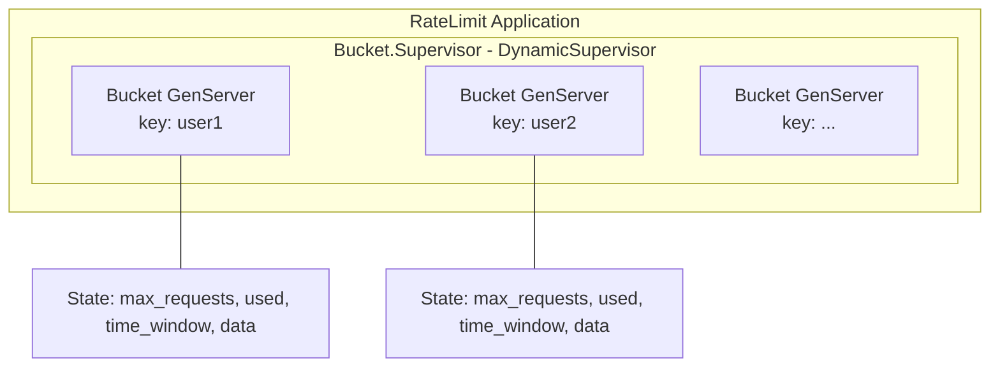

# RateLimit

An OTP learning project implementing a distributed rate limiter using GenServer and DynamicSupervisor patterns.

## Overview

This project implements a rate limiter that enforces N requests per time window, scoped per key (user_id, API key, IP address, etc.), with automatic cleanup of idle buckets.

### Learning Objectives

This project demonstrates key OTP patterns:
- **GenServer**: Each bucket is a GenServer managing its own state
- **DynamicSupervisor**: Buckets are created on-demand and supervised dynamically
- **Process Lifecycle**: Idle buckets automatically terminate without harming the system

### Key Features

- **Per-key scoping**: Each key (user_id, API key, IP, etc.) gets its own isolated rate limit bucket
- **Configurable limits**: Set maximum requests and time window per bucket
- **Automatic cleanup**: Idle buckets terminate after a configurable timeout
- **On-demand creation**: Buckets are created only when needed
- **State management**: Buckets can store and retrieve custom data

## Architecture

The rate limiter uses a one-to-one mapping between keys and GenServer processes:



**Component Overview:**

```
RateLimit Application
└── Bucket.Supervisor (DynamicSupervisor)
    ├── Bucket GenServer (key: "user1")
    │   └── State: max_requests, used, time_window, data
    ├── Bucket GenServer (key: "user2")
    │   └── State: max_requests, used, time_window, data
    └── ... (more buckets created on-demand)
```

### Design Principles

1. **One GenServer per key**: Each bucket is an isolated GenServer process with its own state
2. **Dynamic supervision**: Buckets are started on-demand via `DynamicSupervisor`
3. **Automatic cleanup**: Idle buckets terminate after a configurable timeout period
4. **Fault isolation**: If one bucket crashes, others continue operating normally

## Public API

### `check(bucket)`

Checks the current state of a bucket without consuming a request. Returns bucket information if the key exists and has capacity, or an error if denied or invalid.

**Parameters:**
- `bucket` (String) - The bucket key identifier

**Returns:**
- `{:ok, %{max_requests: integer, used: integer, time_till_refresh: integer}}` - Bucket exists and has capacity
- `{:deny, retry_after_ms: integer}` - Bucket exists but is out of capacity
- `{:invalid_key, key: String}` - Bucket does not exist

**Example:**
```elixir
RateLimit.check("user_123")
# => {:ok, %{max_requests: 5, used: 2, time_till_refresh: 15000}}
```

### `create(bucket, opts \\ [])`

Creates a new bucket with the specified configuration options.

**Parameters:**
- `bucket` (String) - The bucket key identifier
- `opts` (Keyword) - Configuration options:
  - `:max_requests` (integer) - Maximum number of requests allowed (default: `5`)
  - `:time_till_refresh` (integer) - Time window in milliseconds before bucket resets (default: `30000`)

**Returns:**
- `:ok` - Bucket created successfully
- `{:error, :already_exists}` - Bucket already exists

**Example:**
```elixir
RateLimit.create("user_123", max_requests: 10, time_till_refresh: 60000)
# => :ok

RateLimit.create("user_123")
# => {:error, :already_exists}
```

### `put(bucket, data \\ %{})`

Adds or updates fields in the bucket's state. This operation consumes one request from the bucket's allowance.

**Parameters:**
- `bucket` (String) - The bucket key identifier
- `data` (Map) - Key-value pairs to store/update in the bucket state (default: `%{}`)

**Returns:**
- `{:ok, state}` - Successfully updated state, returns the full bucket state
- `{:deny, retry_after_ms: integer}` - Bucket is out of capacity
- `{:invalid_key, key: String}` - Bucket does not exist

**Example:**
```elixir
RateLimit.put("user_123", %{name: "Alice", role: "admin"})
# => {:ok, %{name: "Alice", role: "admin", ...}}

RateLimit.put("user_123", %{role: "user"})
# => {:ok, %{name: "Alice", role: "user", ...}}
```

### `get(bucket, fields \\ [])`

Retrieves the bucket's state or specific fields. This operation consumes one request from the bucket's allowance.

**Parameters:**
- `bucket` (String) - The bucket key identifier
- `fields` (List) - Optional list of field names to retrieve (default: `[]` - returns all fields)

**Returns:**
- `{:ok, state}` - Successfully retrieved state (full state or requested fields)
- `{:deny, retry_after_ms: integer}` - Bucket is out of capacity
- `{:invalid_key, key: String}` - Bucket does not exist

**Example:**
```elixir
RateLimit.get("user_123")
# => {:ok, %{name: "Alice", role: "admin", ...}}

RateLimit.get("user_123", [:name, :role])
# => {:ok, %{name: "Alice", role: "admin"}}
```

## Configuration

### Default Values

When creating a bucket without specifying options, the following defaults are used:

- `max_requests: 5` - Allows 5 requests per time window
- `time_till_refresh: 30000` - 30 second time window (in milliseconds)

These defaults are chosen to be easy to test and demonstrate the rate limiting behavior.

### Options Structure

```elixir
[
  max_requests: 5,           # Maximum requests allowed
  time_till_refresh: 30000   # Time window in milliseconds
]
```

### Idle Timeout

Buckets automatically terminate after a configurable idle timeout period. This prevents memory leaks and ensures the system cleans up unused buckets. The idle timeout can be configured at the supervisor level.

## Usage Examples

### Basic Usage Flow

```elixir
# Create a bucket
RateLimit.create("api_key_abc")

# Check bucket status (doesn't consume a request)
{:ok, info} = RateLimit.check("api_key_abc")
# => {:ok, %{max_requests: 5, used: 0, time_till_refresh: 30000}}

# Store data (consumes 1 request)
{:ok, state} = RateLimit.put("api_key_abc", %{user_id: 123, ip: "192.168.1.1"})

# Retrieve data (consumes 1 request)
{:ok, data} = RateLimit.get("api_key_abc", [:user_id])
# => {:ok, %{user_id: 123}}
```

### Error Handling

```elixir
# Attempt to use a non-existent bucket
RateLimit.get("nonexistent")
# => {:invalid_key, key: "nonexistent"}

# Exceed rate limit
RateLimit.create("limited", max_requests: 2)

RateLimit.put("limited", %{})  # Request 1
# => {:ok, %{}}

RateLimit.put("limited", %{})  # Request 2
# => {:ok, %{}}

RateLimit.put("limited", %{})  # Request 3 - denied!
# => {:deny, retry_after_ms: 25000}
```

### Multiple Bucket Scenarios

```elixir
# Different buckets are isolated
RateLimit.create("user_1", max_requests: 3)
RateLimit.create("user_2", max_requests: 10)

# User 1 exhausts their limit
RateLimit.put("user_1", %{})  # 1/3
RateLimit.put("user_1", %{})  # 2/3
RateLimit.put("user_1", %{})  # 3/3
RateLimit.put("user_1", %{})  # Denied!

# User 2 still has capacity
RateLimit.put("user_2", %{})  # 1/10 - OK!
```

## Implementation Notes

### On-Demand Bucket Creation

Buckets are created lazily when first accessed. The `DynamicSupervisor` starts a new `GenServer` process for each unique key. This ensures efficient resource usage - only active buckets consume memory and CPU.

### Request Consumption and Refresh Logic

Each bucket maintains:
- `max_requests`: The maximum number of requests allowed
- `used`: The current number of requests consumed
- `time_till_refresh`: Milliseconds until the bucket resets

When a request is made via `put/2` or `get/2`:
1. If `used < max_requests`: Increment `used` and process the request
2. If `used >= max_requests`: Return `{:deny, retry_after_ms: ...}`

The bucket automatically resets when the time window expires, setting `used` back to 0.

### Idle Bucket Cleanup Mechanism

Buckets that remain idle (no requests) for a configurable timeout period will automatically terminate. This is implemented using GenServer timeouts and ensures the system doesn't accumulate unused processes. When a bucket is needed again after termination, it will be recreated on-demand.

## Installation

If [available in Hex](https://hex.pm/docs/publish), the package can be installed by adding `rate_limit` to your list of dependencies in `mix.exs`:

```elixir
def deps do
  [
    {:rate_limit, "~> 0.1.0"}
  ]
end
```

## Documentation

Documentation can be generated with [ExDoc](https://github.com/elixir-lang/ex_doc) and published on [HexDocs](https://hexdocs.pm). Once published, the docs can be found at <https://hexdocs.pm/rate_limit>.
